### ERD 구조도

> 2026-10-02 기준 운영 스키마(Flyway 마이그레이션 + 엔티티)로 다시 그렸습니다.
> 실선(`||--o{`)은 DB 외래키가 있는 관계, 점선(`||..o{`)은 ID만 보유하는 논리적 관계입니다.

```mermaid
erDiagram
    member ||--o{ schedules : "FK fk_schedules_member"
    category ||--o{ schedules : "FK fk_schedules_category"
    schedules ||--o{ attach : "FK fk_attach_schedule"
    category ||..o{ category : "parent_id"

    member ||..o{ notification : "user_id"
    schedules ||..o{ notification : "schedule_id"
    member ||..|| notification_setting : "user_id (UNIQUE)"
    member ||..o{ push_subscription : "member_id"
    member ||..o{ chat_history : "member_id"

    member {
        BIGINT id PK
        VARCHAR user_id UK "로그인 아이디 (uk_member_user_id)"
        VARCHAR password "소셜 회원은 NULL"
        VARCHAR user_email
        VARCHAR user_name
        VARCHAR user_phone
        VARCHAR roles
        BOOLEAN is_deleted_user
    }

    category {
        BIGINT id PK
        VARCHAR name
        BIGINT parent_id
        BIGINT depth
        BOOLEAN is_deleted_category
        VARCHAR created_by "수정·삭제 권한 판단"
    }

    schedules {
        BIGINT id PK
        BIGINT member_id FK
        BIGINT category_id FK
        VARCHAR contents
        TIMESTAMP start_time "UK (member_id, start_time)"
        TIMESTAMP end_time
        VARCHAR progress_status
        VARCHAR schedule_type
        VARCHAR repeat_type
        VARCHAR repeat_group_id
        INT repeat_count
        INT repeat_interval
        BOOLEAN is_all_day
        BOOLEAN is_deleted_scheduled
    }

    attach {
        BIGINT id PK
        BIGINT scheduled_id FK
        VARCHAR origin_file_name
        VARCHAR stored_file_name
        VARCHAR file_path
        VARCHAR thumbnail_file_path
        BIGINT file_size
        BOOLEAN is_deleted_attach
        VARCHAR created_by "삭제 권한 판단"
    }

    notification {
        BIGINT id PK
        BIGINT user_id
        BIGINT schedule_id
        VARCHAR notification_type "SCHEDULE_REMINDER 등"
        VARCHAR message
        TIMESTAMP scheduled_at "리마인드 발송 시각"
        BOOLEAN is_read
        BOOLEAN is_sent
        BOOLEAN is_reminder_sent "발송 선점(CAS) 플래그"
    }

    notification_setting {
        BIGINT id PK
        BIGINT user_id UK
        BOOLEAN web_enabled
        BOOLEAN push_enabled
        BOOLEAN email_enabled
        BOOLEAN schedule_remind_enabled
    }

    push_subscription {
        BIGINT id PK
        BIGINT member_id "UK (member_id, endpoint)"
        VARCHAR endpoint UK
        VARCHAR p256dh
        VARCHAR auth
        VARCHAR user_agent
        BOOLEAN active
        DATETIME created_at
        DATETIME revoked_at
    }

    chat_history {
        BIGINT id PK
        BIGINT member_id
        TEXT user_message
        TEXT assistant_response
        DATETIME created_at
    }

    outbox_event_entity {
        VARCHAR id PK "UUID"
        VARCHAR aggregate_type "SCHEDULE / MEMBER / CHAT"
        VARCHAR aggregate_id "Kafka 메시지 키"
        VARCHAR event_type
        MEDIUMTEXT payload
        BOOLEAN sent "IDX (sent, created_at)"
        INT retry_count "5 초과 시 DLQ"
        DATETIME created_at
        DATETIME sent_at
        VARCHAR claim_id "배치 선점 ID, IDX"
        DATETIME claimed_at "30초 지나면 다시 선점"
    }

    processed_event {
        BIGINT id PK
        VARCHAR consumer "UK (consumer, event_id)"
        VARCHAR event_id
        TIMESTAMP processed_at
    }

    failed_message {
        BIGINT id PK
        VARCHAR topic
        VARCHAR message_type "NOTIFICATION / WEB_PUSH / MEMBER_SIGNUP"
        VARCHAR payload
        INT retry_count
        BOOLEAN resolved
        BOOLEAN dead
        TIMESTAMP next_retry_time
    }

    failed_thumbnail {
        BIGINT id PK
        VARCHAR stored_file_name
        VARCHAR reason
        INT retry_count
        BOOLEAN resolved
    }

    fail_email_entity {
        BIGINT id PK
        VARCHAR to_email
        VARCHAR subject
        TEXT content
        BOOLEAN resolved
    }
```

테이블은 역할에 따라 세 묶음으로 나뉩니다.

| 묶음 | 테이블 | 역할 |
|---|---|---|
| 도메인 | member, category, schedules, attach | 서비스 핵심 데이터. 외래키로 무결성 강제 |
| 알림·챗봇 | notification, notification_setting, push_subscription, chat_history | 회원 ID만 보유하는 논리적 관계 |
| 이벤트 처리 인프라 | outbox_event_entity, processed_event, failed_message, failed_thumbnail, fail_email_entity | 발행·멱등성·재처리. 도메인과 독립 |

### ERD 설계 핵심 원칙

본 프로젝트의 ERD는 단순한 관계 모델링을 넘어,이벤트 재처리, 멱등성 보장, 장애 격리를 고려한 운영 중심 데이터 구조를 목표로 설계했습니다.

장애 발생 시 메시지 재전송이나 멱등성 처리가 시스템 전체의 부작용으로 확산되지 않도록 '격리와 무결성'을 핵심 설계 기준으로 삼았습니다.

---
#### 객체 참조를 배제한 ID 기반 약결합

엔티티 간 직접적인 객체 참조 대신 ID(Long) 값만 보유하는 구조를 채택했습니다. 이를 통해 특정 도메인의 재처리 작업이 연쇄적인 조회를 일으키는 것을 방지하고, 도메인 간의 의존성을 최소화했습니다.

---

#### DB 제약조건을 통한 정합성 강제

데이터 무결성을 애플리케이션 계층(JPA)에만 의존하지 않고, DB 수준의 Foreign Key와 제약조건으로 강제했습니다. 이는 운영 단계에서 어떤 기술적 변수가 발생하더라도 데이터의 최종 정합성을 보장하기 위함입니다.

- 회원 아이디 중복 가입 방지: `member.user_id` UNIQUE
- 같은 회원의 같은 시작 시각 일정 중복 방지: `schedules (member_id, start_time)` UNIQUE

---

#### 이벤트 처리 인프라의 독립성

Outbox, FailMessage(실패 기록), ProcessedEvent(멱등성 처리) 테이블을 독립적으로 설계했습니다. 특정 기능의 실패가 전체 시스템으로 전이되지 않도록 격리하여, DLQ 재처리나 EOS(Exactly-Once Semantic) 상황에서도 안정적인 복구가 가능합니다.

---

#### 멱등성 기록은 컨슈머 단위로

`processed_event`의 유니크 키는 `(consumer, event_id)`입니다. 하나의 이벤트를 여러 컨슈머 그룹이 각자 처리하는 구조(예: 챗봇 대화 이벤트를 이력 저장 그룹과 패턴 분석 그룹이 각각 소비)에서, `event_id`만으로 중복을 막으면 먼저 처리한 그룹이 나머지 그룹을 "이미 처리됨"으로 건너뛰게 만듭니다. 운영 로그로 이 충돌을 확인하고 컨슈머 단위로 바꿨습니다.

---

#### Outbox 발행은 배치로 선점

`outbox_event_entity`의 `claim_id`, `claimed_at`은 발행기가 한 번의 UPDATE로 여러 건을 선점하기 위한 컬럼입니다. 미발행이면서 선점되지 않았거나 선점한 지 30초가 지난 행에 이번 실행의 `claim_id`를 기록하고, 그 행만 발행합니다. 행 단위 쓰기 락과 조건 덕분에 한 이벤트는 한 실행만 가져가며, 발행 도중 서버가 죽어도 30초 뒤 다른 실행이 회수합니다. 이전에는 건마다 선점 UPDATE와 발행 완료 UPDATE가 따로 일어나 한 주기에 DB 왕복이 약 400번이었습니다.

---

### 변경 이력

| 날짜 | 변경 | 이유 |
|---|---|---|
| 2026-09-28 | `member.user_id` UNIQUE 추가 | 중복 가입 시 같은 아이디 회원이 2명 생겨 로그인이 실패하던 문제 |
| 2026-10-01 | `chat_history`, `push_subscription`, `outbox_event_entity` 마이그레이션 추가 | 엔티티만 있고 마이그레이션이 없어, 로컬(ddl-auto: update)에서는 보이지 않던 테이블 누락이 운영에서 드러남 |
| 2026-10-01 | `processed_event`에 `consumer` 컬럼, 유니크 키를 `(consumer, event_id)`로 변경 | 컨슈머 그룹 간 중복 처리 충돌 |
| 2026-10-02 | `outbox_event_entity`에 `claim_id`, `claimed_at` 컬럼과 `(sent, created_at)`, `(claim_id)` 인덱스 추가 | 발행을 건별 선점에서 배치 선점으로 변경 (490VU에서 발행 한계 약 50 events/s) |

### 알려진 한계

- `schedules.start_time`, `end_time` 등이 MySQL `TIMESTAMP`라 2038-01-19 03:14:07(UTC) 이후 값을 저장할 수 없습니다. `DATETIME`으로 전환이 필요합니다.
- `failed_message.payload`의 유니크 키는 앞 255자 기준이라, 앞부분이 같은 서로 다른 메시지가 충돌할 수 있습니다.
