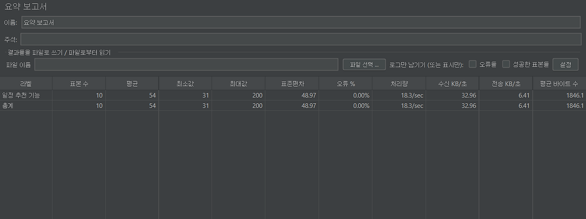
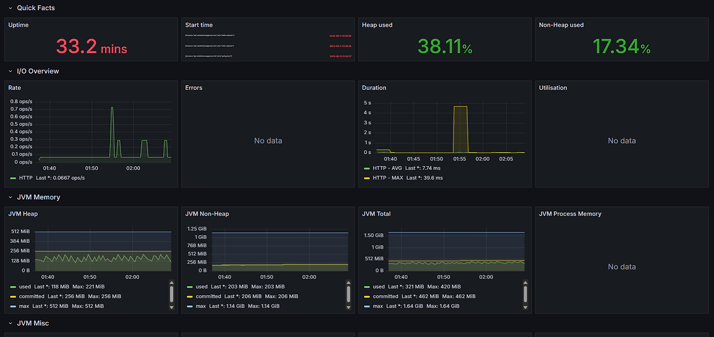
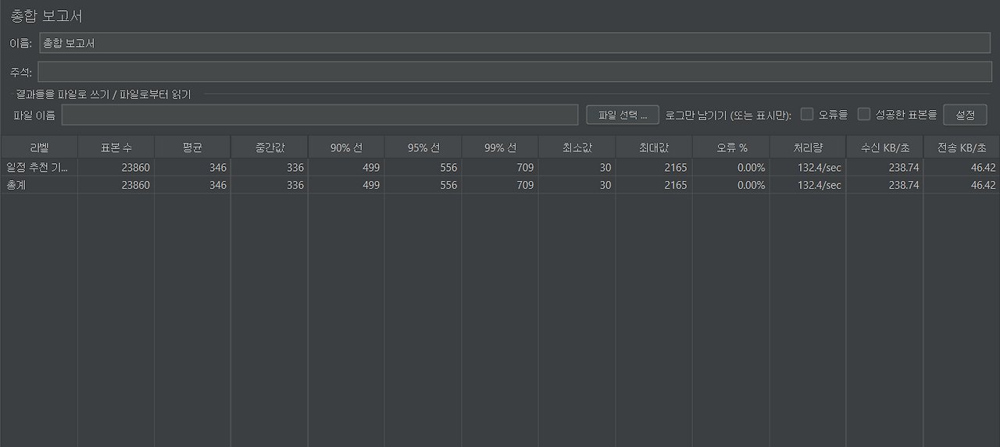
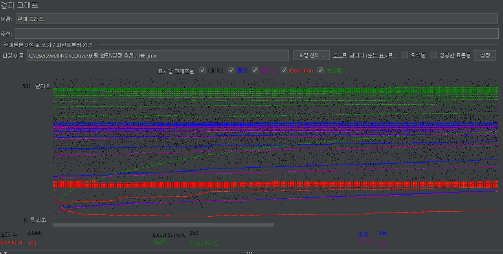
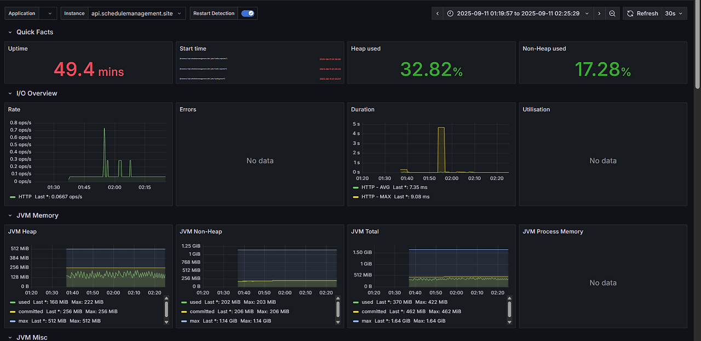
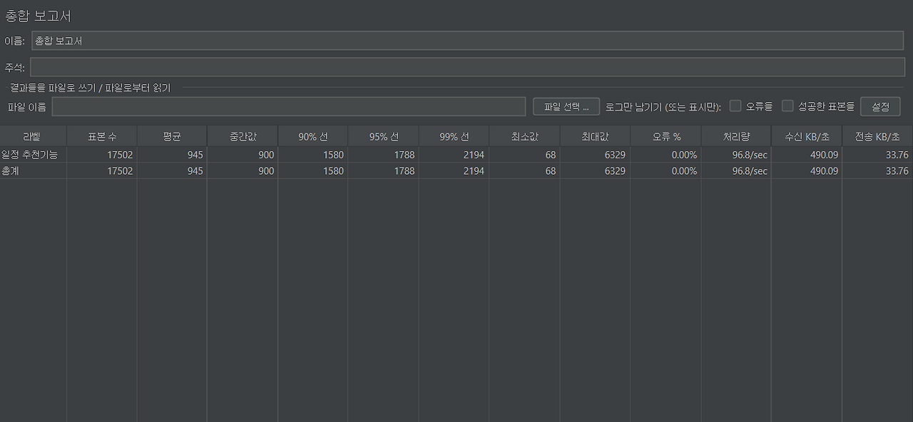
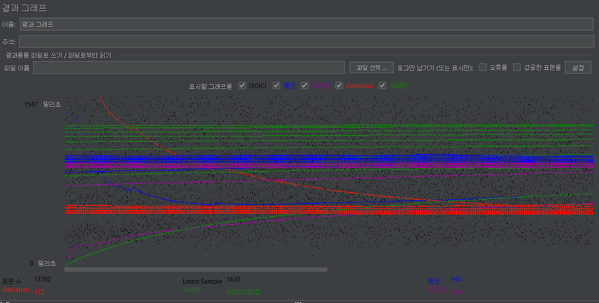
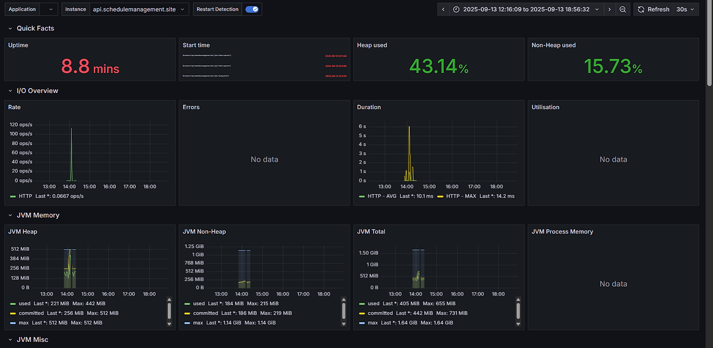

## WebClient 기반 일정 추천 API 성능 검증

### 테스트 목적

- WebClient 기반 비동기 호출이 실제 부하 환경에서도 안정적으로 동작하는지
- 캐싱 적용 이후 응답 시간과 처리량이 어떻게 변화하는지
- 제한된 리소스 환경(LightSail 2GB)에서 어느 수준까지 버틸 수 있는지

### 테스트 환경

서버 환경
- AWS Lightsail 2GB VM
- JVM Heap: 512MB ~ 1GB
- HikariCP max pool size: 20

API
- Endpoint: /api/chat/recommend
- 인증: JWT 헤더 포함

측정 도구
- JMeter: 요청 부하 및 응답 시간 측정
- Grafana (Prometheus 연동): JVM Heap, GC, DB 커넥션 풀 상태 모니터링

### 테스트 시나리오

정상 호출 테스트
- 단일 사용자
  - 10회 반복 호출
- 부하 테스트
  - 동시 사용자 50명 / 100명
  - Ramp-up: 30초
  - Duration: 3분

### 단일 호출 테스트 (10회)

결과 요약

- 평균 응답시간: 54ms
- 최소 / 최대: 31ms ~ 200ms
- 표준편차: ~49ms
- 에러율: 0%
- 처리량: ~18 req/sec
- JVM Heap 사용량: ~118MiB (Max 221MiB)
- GC Pause: 거의 없음
- CPU 사용률: 유의미한 변화 없음

### 부하 테스트 (50 VU)

조건
- 동시 사용자: 50명
- Ramp-up: 30초
- Duration: 3분

결과 요약
- 평균 응답시간: 346ms
- P95: 556ms
- P99: 709ms
- 최대 응답시간: 2.1s
- 처리량: ~132 req/sec
- 에러율: 0%
- JVM Heap: 평균 ~118MiB, 안정적 유지
- GC: Full GC 없음
- DB 풀: active connection 수가 최대치(20)에 근접, 부하 구간에서 pending 증가

해석
50명 동시 요청까지는 안정적으로 처리되었으며, 대부분의 요청이 P95 기준 600ms 이내로 응답했다.
다만 일부 tail latency(P99 이상) 구간에서 2초를 초과하는 응답이 발생하며, DB 커넥션 풀이 병목 지점으로 관측되었다.

### 부하 테스트 (100 VU)

조건
- 동시 사용자: 100명
- Ramp-up: 30초
- Duration: 3분

결과 요약
- 평균 응답시간: 945ms
- P95: 1.78s
- P99: 2.1s
- 최대 응답시간: 6.3s
- 처리량: ~96 req/sec
- 에러율: 0%
- JVM Heap: 안정적 유지
- GC: Minor GC pause 약 ~100ms 발생
- DB 풀: 동시성 구간에서 대기 시간 증가

해석
LightSail 2GB 환경 기준으로 동시 사용자 100명까지 서비스는 중단 없이 동작했다.
P95 기준 응답 시간은 2초 이내로 유지되었으나, GC pause와 DB 커넥션 풀 대기 시간이 증가하며
리소스 한계가 점진적으로 드러났다.

## WebClient 성능 테스트 결론

WebClient + 캐싱 구조는 외부 API 호출이 포함된 환경에서도 안정적으로 동작했다.

50명 동시 요청까지는 여유 있는 성능을 보였으며,100명 동시 요청에서도 에러 없이 처리되었으나,
JVM GC 및 DB 커넥션 풀이 병목 지점으로 관측되었다.

해당 결과를 통해, **현 인프라(LightSail 2GB) 기준 중소 규모 트래픽 환경에서는 충분히 운영 가능**하다고 판단했다.

